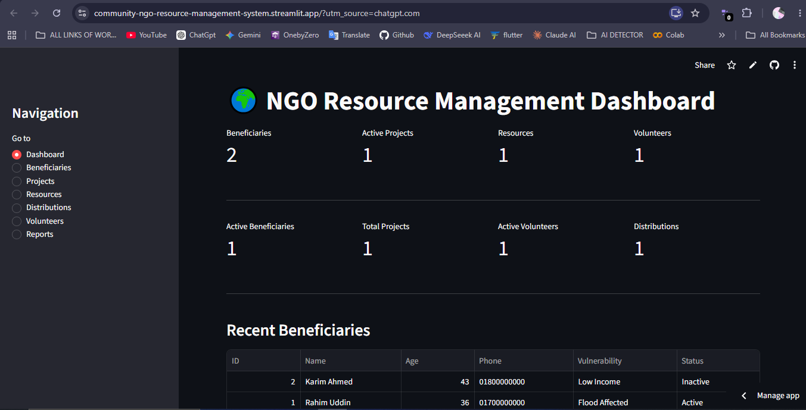

# 🌍 Community & NGO Resource Management System

An interactive web-based management system designed for community organizations and NGOs to manage beneficiaries, projects, resources, distributions, and volunteers.

## 🚀 Live Demo

👉 https://community-ngo-resource-management-system.streamlit.app/

## 📸 Dashboard Preview



## 📌 Project Overview

This project is a Community and NGO Resource Management System developed to demonstrate how software engineering and database management can support development-sector operations.

The system provides a centralized platform for managing beneficiary information, development projects, available resources, resource distributions, and volunteers.

## 🎯 Objectives

- Manage beneficiary information
- Track NGO projects
- Maintain resource inventory
- Record resource distributions
- Manage volunteers
- Provide operational statistics
- Demonstrate practical database management

## 📊 Key Features

- 👥 Beneficiary registration and management
- 🔎 Beneficiary search and filtering
- ✏️ Beneficiary information update
- 📋 Project management
- 📦 Resource inventory management
- 🤝 Resource distribution tracking
- 🙋 Volunteer management
- 📊 Interactive dashboard
- 📈 Basic reports and statistics

## 🛠️ Technologies Used

- Python
- Streamlit
- SQLite
- SQL
- Git
- GitHub

## 🗄️ Database

The system uses SQLite for data storage.

Main entities:

- Beneficiaries
- Projects
- Resources
- Distributions
- Volunteers

## 🔄 System Workflow

```text
Beneficiary Registration
          ↓
Project Management
          ↓
Resource Inventory
          ↓
Resource Distribution
          ↓
Volunteer Management
          ↓
Dashboard & Reports